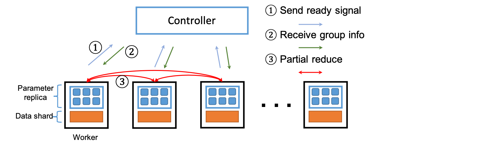

Heterogeneity-aware Training
========================================

All-reduce is the key communication primitive used in distributed data-parallel training due to the high performance in the homogeneous environment. However, All-reduce is sensitive to stragglers and communication delays as deep learning has been increasingly deployed on the heterogeneous environment like cloud. 

We propose and analyze a novel variant of all-reduce, called partial-reduce, which provides high heterogeneity tolerance and performance by decomposing the synchronous all-reduce primitive into parallel-asynchronous partial-reduce operations. 



We provide theoretical guarantees, proving that partial-reduce converges to a stationary point at the similar sub-linear rate as distributed SGD. To enforce the convergence of the partial-reduce primitive, we further propose a dynamic staleness-aware distributed averaging algorithm and implement a novel group generation mechanism to prevent possible update isolation in heterogeneous environments. The experiments on real production cluster show that it is 1.21×-2× faster than other state-of-the-art baselines.

Our paper has been published in SIGMOD 2021. Please cite our paper if you use it.

```
 @inproceedings{sigmod/preduce21,
   title = {Heterogeneity-Aware Distributed Machine Learning Training via Partial Reduce},
   author = {Xupeng Miao and
             Xiaonan Nie and
             Yingxia Shao and
             Zhi Yang and
             Jiawei Jiang and
             Lingxiao Ma and
             Bin Cui},
   booktitle = {SIGMOD 2021},
   year = {2021},
   url  = {https://doi.org/10.1145/3318464.3389706},
   doi  = {10.1145/3318464.3389706},
 }
```