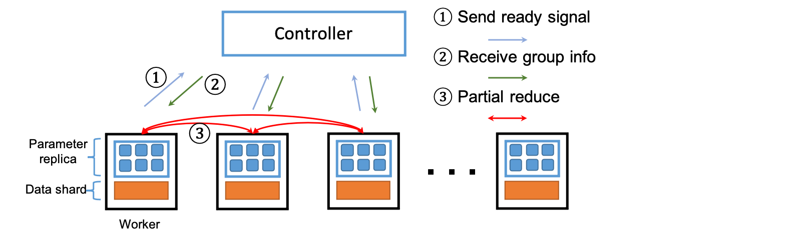

异构性训练
========================================
由于在同质环境下的高性能，all-reduce是分布式数据并行训练中使用的关键通信原语。然而，随着深度学习越来越多地部署在云上的异构环境中，all-reduce对掉队者和通信延迟非常敏感。

我们提出并分析了一种新的all-reduce变体，称为partial-reduce，它通过将同步all-reduce原语分解为并行异步部分reduce操作，来提供高度的异构容忍度和性能。


我们提供了理论保证，证明了partial-reduce以类似于分布式SGD的次线性速率收敛到一个稳定点。为了增强partial-reduce原语的收敛性，我们进一步提出了一种动态状态感知分布式平均算法，并实现了一种新的组生成机制，以防止异构环境中可能出现的更新隔离。在实际生产集群上的实验表明，它比其他最先进的基线快1.21到2倍。

我们的论文已经发表在SIGMOD 2021。如果你使用的话，请引用我们的论文。

```
 @inproceedings{sigmod/preduce21,
   title = {Heterogeneity-Aware Distributed Machine Learning Training via Partial Reduce},
   author = {Xupeng Miao and
             Xiaonan Nie and
             Yingxia Shao and
             Zhi Yang and
             Jiawei Jiang and
             Lingxiao Ma and
             Bin Cui},
   booktitle = {SIGMOD 2021},
   year = {2021},
   url  = {https://doi.org/10.1145/3318464.3389706},
   doi  = {10.1145/3318464.3389706},
 }
```