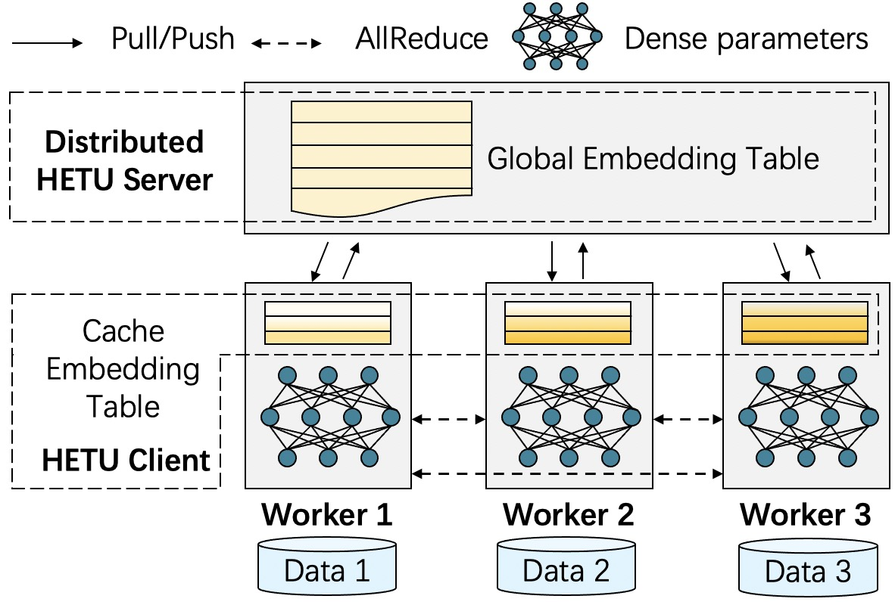

Huge Embedding Model Training
=============================

Embedding models have been recognized as an effective learning paradigm for high-dimensional data. However, one open issue of embedding models lies in its representation (latent factors) often resulting in large parameter space. We observe existing distributed training frameworks face a scalability issue of embedding models since updating and retrieving the shared embedding parameters from servers usually dominate the training cycle. 

We propose a new system framework that signiffcantly improves the scalability of huge embedding model training. We embrace skewed popularity distributions of embeddings as a performance opportunity and leverage it to address the communication bottleneck with an embedding cache. To ensure consistency across the caches, we incorporate a new consistency model into the system design, which provides fine-grained consistency guarantees on a per-embedding basis. 

[comment]: # (Compared to previous work that only allows staleness for read operations, our system also utilizes staleness for write operations. Evaluations on six representative tasks show that it achieves up to 88% embedding communication reductions and up to 20.68x performance speedup over the state-of-the-art baselines.)

Evaluations show that it achieves up to 80% embedding communication reductions and up to 20x performance speedup over the state-of-the-art baselines.

<em>Our paper has been accepted by VLDB 2022 and we will release the full details as soon as possible.</em>

