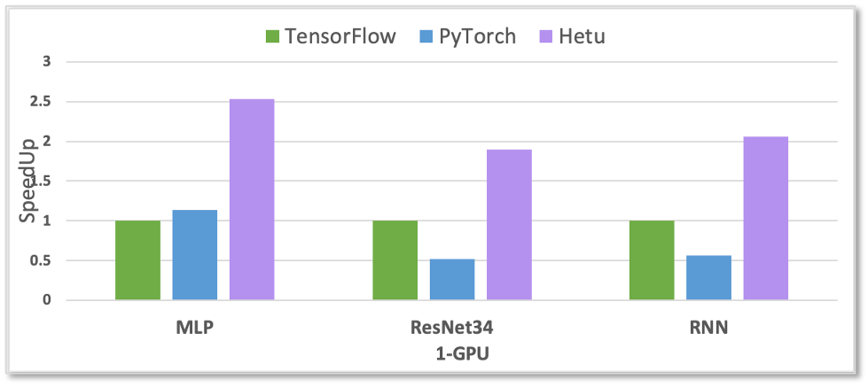
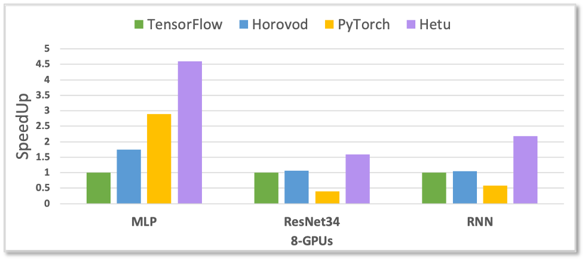
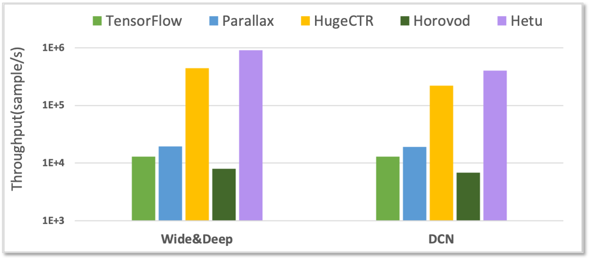
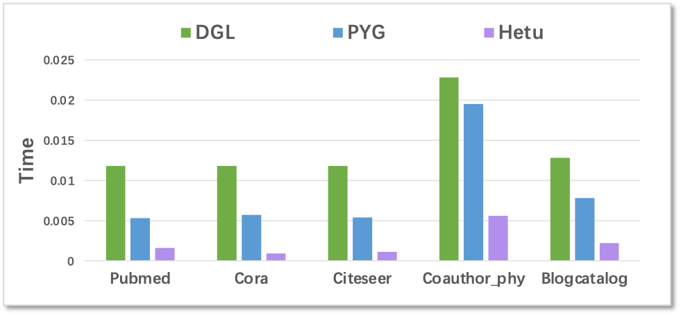
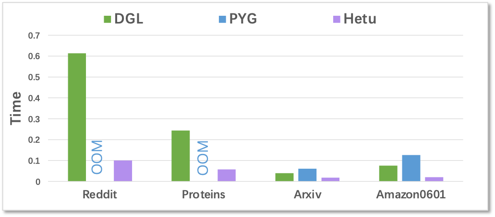
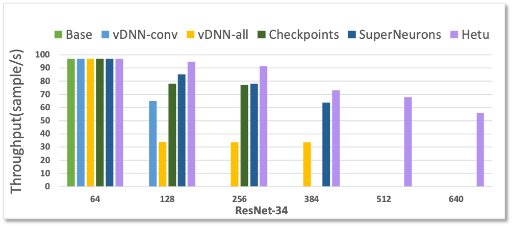
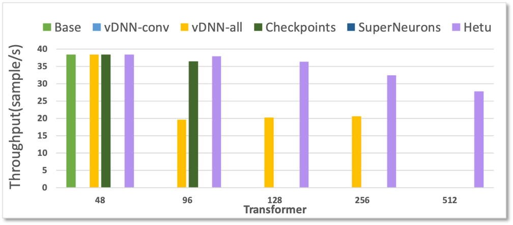

系统性能
============

<!---
## 实验设置

我们使用的模型为ResNet模型，数据集为CIFAR10，并使用TensorFlow对Hetu进行基准测试。
--->

## 性能比较

下图对性能比较进行总结。

- DNN/CNN/RNN 比较

	- Tensorflow/PyTorch/Horovod

- 嵌入式模型比较
	- Parallax/TensorFlow/Horovod/HugeCTR

- GNN 比较
	- DGL/PYG

- 批尺寸比较
	- Swap/Recompute

- AutoML搜索比较

- 预训练模型比较
	- Pipedream/Gpipe/Megatron-LM

<em>我们将公布更多的基准结果和细节。</em>

