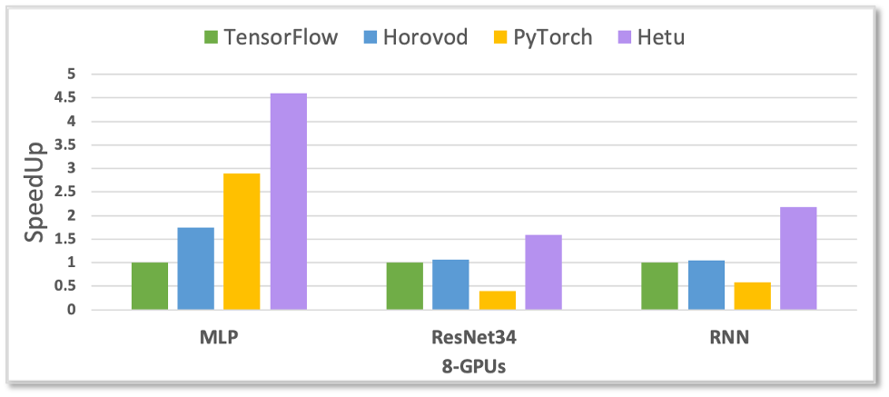
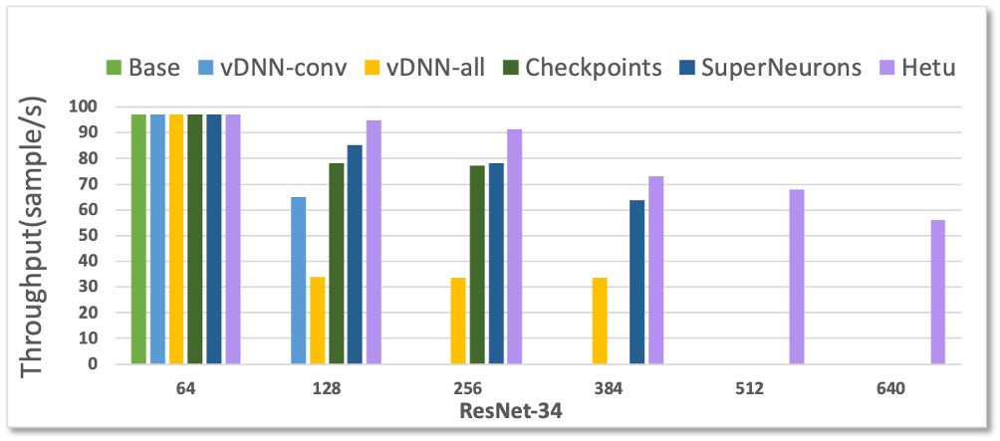
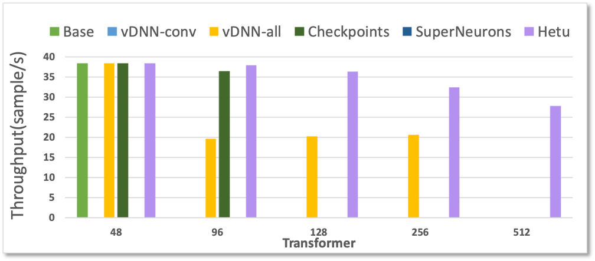

Performance
============

<!---
## Experimental setup

We benchmark Hetu with TensorFlow on the dataset of CIFAR10 across ResNet.
--->

## Peformance comparison

The performance comparison is summarized in the figure below.

- DNN/CNN/RNN comparison

	- Tensorflow/PyTorch/Horovod

- Embedding model comparison
	- Parallax/TensorFlow/Horovod/HugeCTR

- GNN comparison
	- DGL/PYG

- Batch size comparison
	- Swap/Recompute

- AutoML search comparison

- Pretrain model comparison
	- Pipedream/Gpipe/Megatron-LM

<em>More benchmark results and details are coming soon.</em>

