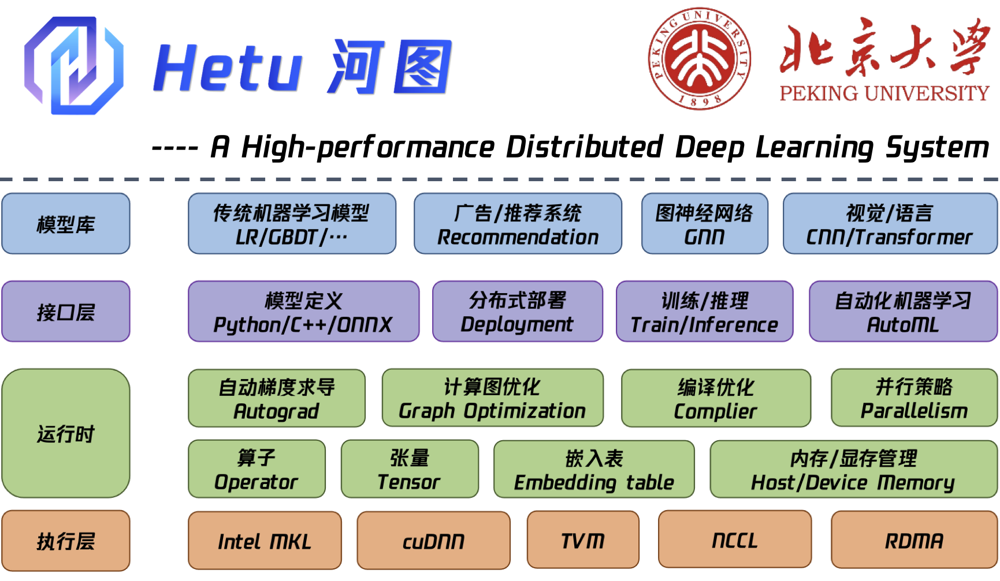

.. Hetu documentation master file, created by
   sphinx-quickstart on Mon May 10 15:06:18 2021.
   You can adapt this file completely to your liking, but it should at least
   contain the root `toctree` directive.

欢迎来到Hetu！
================================

**河图(Hetu)** 是一个兼顾创新性和可用性的分布式深度学习系统，由北京大学崔斌教授团队研发，这也是首个由国内高校自主研发的分布式深度学习系统。该系统与现有相关基线系统完全解耦，并具有多项先进特性：

+ **通用**：采用标准的数据流图方式定义深度学习模型，底层实现了丰富的CPU以及GPU算子库，支持大量常见深度学习模型的计算；另外，该系统还支持10余种主流机器学习算法的高效求解，如：LR、GBDT、LDA等。
+ **高效**：采用多项技术创新，使得其计算性能相比于主流深度学习系统TensorFlow等显著提升，在常见的DNN、CNN、RNN基准测试上取得了至少30%的性能优势。
+ **敏捷**：支持自动化机器学习流程搜索与求解，包括：特征工程、模型选择、超参数调优等，使机器学习模型开发过程更容易。
+ **灵活**：支持参数服务器和全局规约通信架构，支持数据并行、模型并行以及流水线并行等多种并行训练方式，针对硬件环境，通过多种策略组合提供最优分布式部署方案。
+ **扩展**：在硬件上，通过显存优化和通信优化技术，支持上百节点的分布式部署；在模型上，支持千亿级参数规模的深度学习模型训练，已经在Criteo、Open Graph Benchmark等多个大规模基准数据集上进行了测试。

本项目由国家重点研发计划支持，相关成果已经发表了多篇CCF-A类高水平学术论文，目前项目已经开源在：https://github.com/PKU-DAIR/Hetu。

我们欢迎所有对机器学习或分布式系统感兴趣的人提供代码、创建问题或请求。更多细节请参考贡献指南和发展计划。

.. role:: red
    :class: red

.. raw:: html

    

新闻
~~~~~~~~~~~~~~~
- 2021.08.06 :red:`[新]` 我们与腾讯联合共建Angel4.0及Hetu：`link <https://mp.weixin.qq.com/s/03GabpMzwCi7MLvDbCGloQ>`_。
- 2021.07.31 :red:`[新]` 我们在ACM TURC 2021开展了介绍HETU的研讨会：`link <https://www.acmturc.com/2021/en/SIGMOD_China.html>`_。
- 2021.07.28 :red:`[新]` 我们的Hetu系统参加了软件开源创新大赛：`link <https://www.educoder.net/competitions/index/gcc_2021_projects_type1>`_。
- 2021.07.18 :red:`[新]` 我们在GitHub上对Hetu进行开源：https://github.com/PKU-DAIR/Hetu。

.. toctree::
   :titlesonly:
   :caption: 概述

   Overview/design
   Overview/performance

.. toctree::
   :titlesonly:
   :caption: 特征

   Features/content1
   Features/content2
   Features/content3
   Features/content4
   Features/content5

.. toctree::
   :maxdepth: 2
   :caption: 导引

   Tutorials/index
   HetuML/index

.. toctree::
   :maxdepth: 1
   :caption: 发展计划

   plan

.. raw:: html

    

    

    
    

